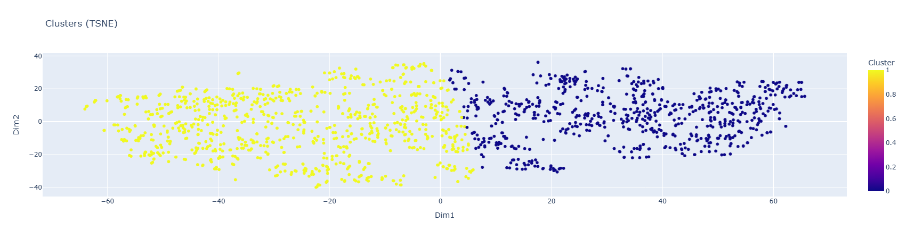

# Rolling Stones Song Cohort Clustering

## Overview

This project uses Spotify audio-feature data for Rolling Stones songs to create song cohorts that can support music recommendation and playlist strategy. The workflow includes exploratory data analysis, feature engineering, dimensionality reduction, KMeans clustering, t-SNE visualization, and cluster profiling.

The project is based on a machine learning course-end project scenario focused on creating cohorts of songs for improved recommendations.

## Business Problem

Streaming platforms improve engagement when they recommend content that aligns with user preferences. This project groups similar songs using Spotify audio features so that recommendation teams can better understand song similarity, listening cohorts, and potential playlist segments.

## Dataset

- Source: Rolling Stones Spotify dataset
- Rows: 1,610
- Columns: 19
- Unique songs: 954
- Unique albums: 90
- Audio features: acousticness, danceability, energy, instrumentalness, liveness, loudness, speechiness, tempo, valence, popularity, duration_ms

## Key Methods

- Data inspection and duplicate review
- Feature selection from Spotify audio attributes
- Standardization of numerical audio features
- KMeans clustering
- Silhouette-score based cluster review
- t-SNE dimensionality reduction for visualization
- Cluster profiling by song attributes

## Main Visualization



## Repository Structure

```text
rolling-stones-song-cohort-clustering/
├── README.md
├── PROJECT_REPORT.md
├── PROBLEM_STATEMENT.md
├── requirements.txt
├── LICENSE
├── .gitignore
├── app.py
├── src/
│   └── analyze_song_cohorts.py
├── tests/
│   └── test_song_cohorts.py
├── data/
│   ├── raw/
│   │   ├── rolling_stones_spotify.csv
│   │   └── data_dictionary_creating_cohorts_of_songs.xlsx
│   └── processed/
├── notebooks/
├── figures/
└── docs/
```

## Run the Analysis

```bash
pip install -r requirements.txt
python src/analyze_song_cohorts.py
```

## Launch the Dashboard

```bash
streamlit run app.py
```

## Run Tests

```bash
pytest -q
```

## Technologies

Python · pandas · NumPy · scikit-learn · Matplotlib · Plotly · Streamlit · Jupyter Notebook

## Portfolio Relevance

This project demonstrates unsupervised machine learning, clustering, dimensionality reduction, feature engineering, model selection, data visualization, and recommendation-system thinking.
