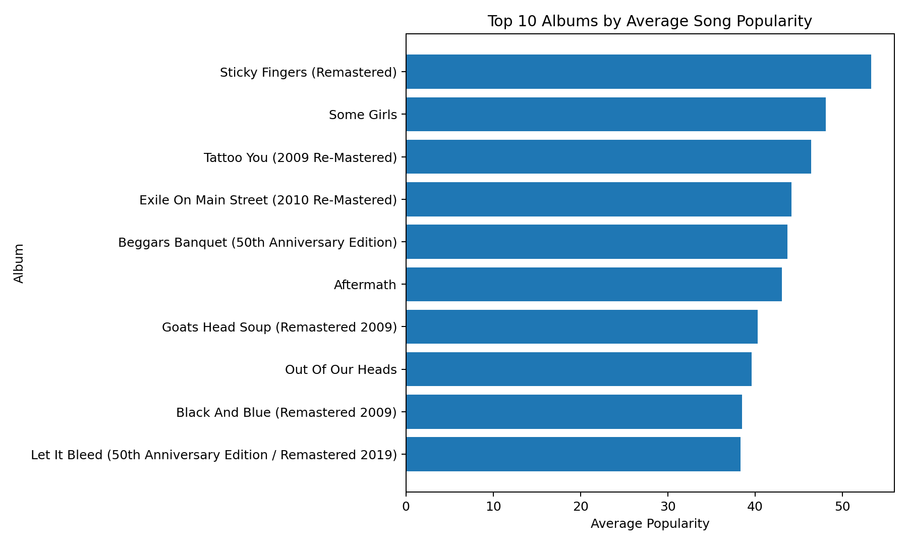
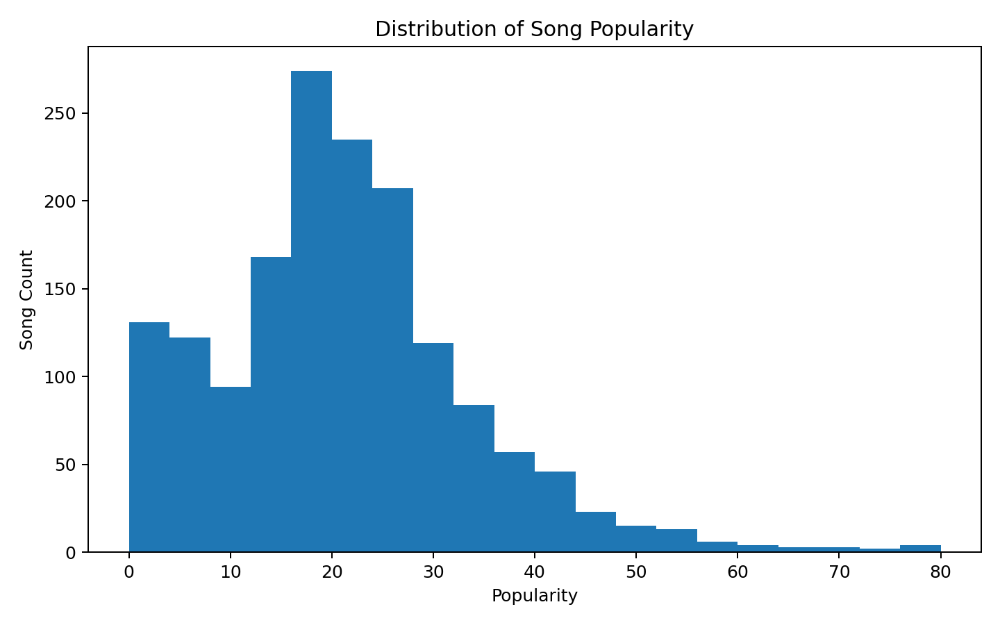
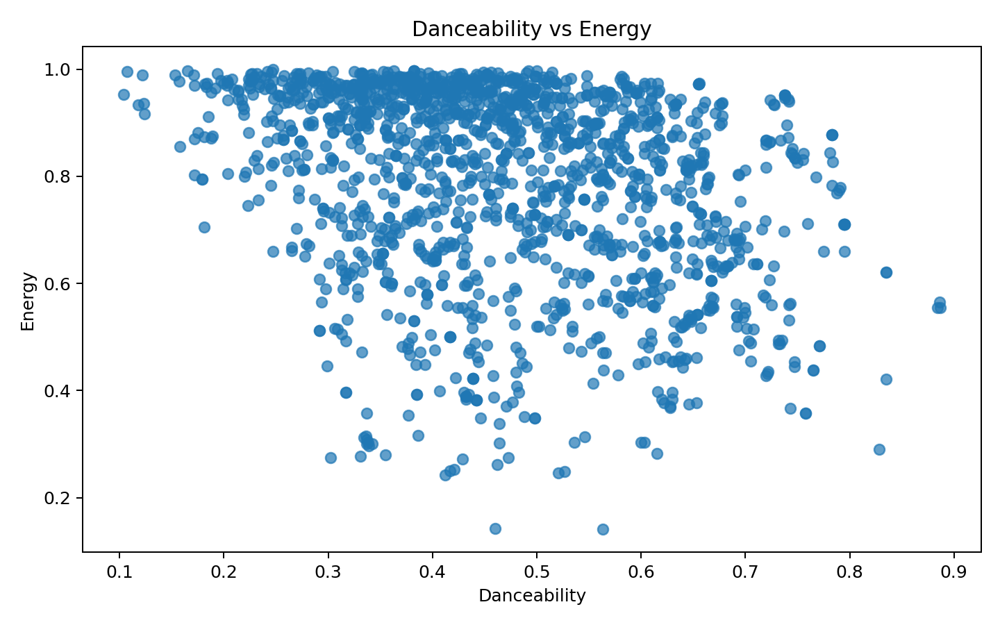

# Rolling Stones Song Cohort Clustering

## Overview

This project uses Spotify audio-feature data for Rolling Stones songs to create **song cohorts** that can support music recommendation and playlist strategy. The upgraded workflow includes exploratory data analysis, feature engineering, KMeans clustering, model comparison, cluster naming, PCA, t-SNE visualization, model artifact export, and a Streamlit dashboard.

The project is based on a machine learning course-end project scenario focused on creating cohorts of songs for improved recommendations.

## Business Problem

Streaming platforms improve engagement when they recommend content that aligns with user preferences. This project groups similar songs using Spotify audio features so recommendation teams can understand song similarity, listening cohorts, and potential playlist segments.

## Dataset

- Source: Rolling Stones Spotify dataset
- Rows: **1,610**
- Columns: **19**
- Unique songs: **954**
- Unique albums: **90**
- Audio features used: `acousticness, danceability, energy, instrumentalness, liveness, loudness, speechiness, tempo, valence, popularity, duration_ms`

## Key Methods

- Data inspection and duplicate removal
- Feature selection from Spotify audio attributes
- Standardization of numerical audio features
- KMeans clustering with silhouette-score based cluster review
- Gaussian Mixture and DBSCAN comparison baselines
- PCA and t-SNE dimensionality reduction for visualization
- Automated business-friendly cluster naming
- Cluster profiling by audio attributes
- Model artifact export with `joblib`

## Main Visualization


## Additional Visuals







## Generated Outputs

Running `src/analyze_song_cohorts.py` regenerates:

- `data/processed/rolling_stones_song_clusters.csv`
- `data/processed/cluster_profile.csv`
- `data/processed/model_comparison.csv`
- `data/processed/model_selection_scores.json`
- `figures/clusters_tsne_generated.png`
- `figures/clusters_pca_generated.png`
- `models/scaler.joblib`
- `models/kmeans_model.joblib`
- `models/pca_model.joblib`
- `models/cluster_metadata.joblib`

## Repository Structure

```text
rolling-stones-song-cohort-clustering/
├── README.md
├── PROJECT_REPORT.md
├── PROBLEM_STATEMENT.md
├── MODEL_CARD.md
├── requirements.txt
├── LICENSE
├── .gitignore
├── app.py
├── src/
│   └── analyze_song_cohorts.py
├── tests/
│   └── test_song_cohorts.py
├── data/
│   ├── raw/
│   │   ├── rolling_stones_spotify.csv
│   │   └── data_dictionary_creating_cohorts_of_songs.xlsx
│   └── processed/
│       ├── rolling_stones_spotify_clean.csv
│       ├── album_summary.csv
│       ├── audio_feature_summary.csv
│       └── key_metrics.json
├── notebooks/
│   ├── creating_cohorts_of_songs_project.ipynb
│   └── creating_cohorts_of_songs_project_v2.ipynb
├── figures/
│   ├── clusters_tsne.png
│   ├── top_albums_by_popularity.png
│   ├── popularity_distribution.png
│   └── danceability_vs_energy.png
└── docs/
    └── problem_statement.docx
```

## Run the Analysis

```bash
pip install -r requirements.txt
python src/analyze_song_cohorts.py
```

## Launch the Dashboard

```bash
streamlit run app.py
```

## Run Tests

```bash
pytest -q
```

## Technologies

Python · pandas · NumPy · scikit-learn · Matplotlib · Plotly · Streamlit · Jupyter Notebook · joblib

## Portfolio Relevance

This project demonstrates unsupervised machine learning, clustering, dimensionality reduction, model comparison, feature engineering, model artifact management, data visualization, and recommendation-system thinking.
